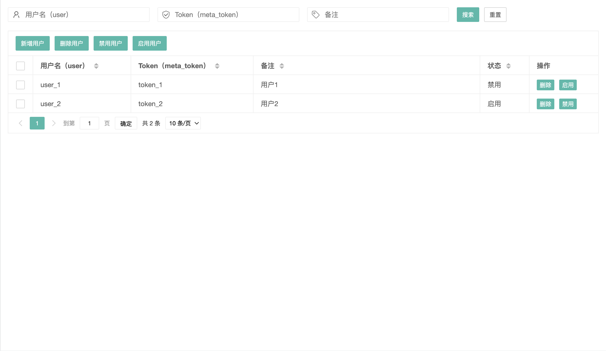
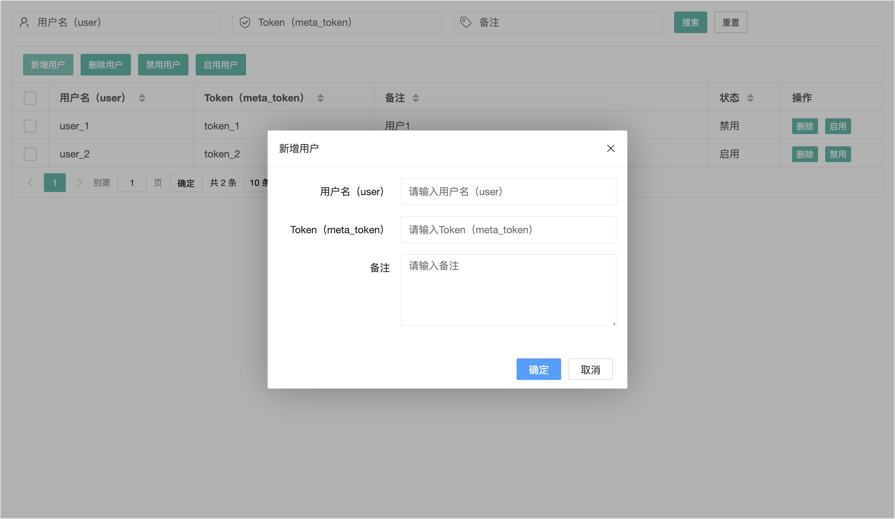
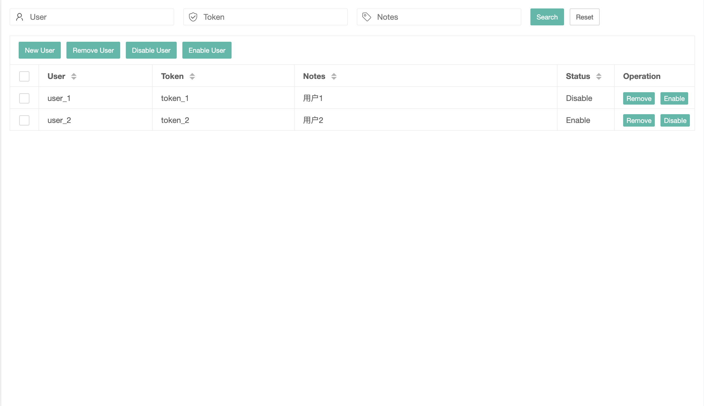

# frps-multiuser

[README](README.md) | [中文文档](README_zh.md)

frps-multiuser 是 [frp](https://github.com/fatedier/frp) 的一个服务端插件，用于支持多用户鉴权。

frps-multiuser 会以一个单独的进程运行，并接收 frps 发送过来的 HTTP 请求。





## 更新说明

+ **配置文件改为ini格式，便于增加注释**
+ **删除-l参数，其需要的配置由`frps-multiuser.ini`决定**
+ **指定配置文件的参数由`-f`改为`-c`，和`frps`一致**
+ **配置文件中，\[users\]节下如无用户信息，则直接由frps的token认证**
+ **配置文件中，\[disabled\]节下用户名对应的值如果为`disable`，则说明该账户被禁用，无法连接到服务器**
+ **新增动态`添加`、`删除`、`禁用`、`启用`用户**

***用户被`删除`或`禁用`后，不会马上生效，需要等一段时间***

### 功能

* 通过配置文件配置所有支持的用户名和 Token，只允许匹配的 frpc 客户端登录。

### 下载

通过 [Release](../../releases) 页面下载对应系统版本的二进制文件到本地。

### 要求

需要 frp 版本 >= v0.31.0

### 使用示例

1. 创建 `frps-multiuser.ini` 文件，内容为所有支持的用户名和 token。

```ini
[common]
;插件监听地址
plugin_addr = 127.0.0.1
;插件端口
plugin_port = 7200
;插件管理页面账号,可选
admin_user  = admin
;插件管理页面密码,与账号一起进行鉴权,可选
admin_pwd   = admin

[users]
;user1
user1 = 123
;user2
user2 = abc

[disabled]
;user2被禁用
user2 = disable
```

    每一个用户占一行，用户名和 token 之间以 `=` 号分隔。

2. 运行 frps-multiuser，指定监听地址以及 token 存储文件路径。

    `./frps-multiuser -c ./frps-multiuser.ini`

3. 在 frps 的配置文件中注册插件，并启动。

```ini
# frps.ini
[common]
bind_port = 7000

[plugin.multiuser-login]
addr = 127.0.0.1:7200
path = /handler
ops = Login

[plugin.multiuser-new-work-conn]
addr = 127.0.0.1:7200
path = /handler
ops = NewWorkConn

[plugin.multiuser-new-user-conn]
addr = 127.0.0.1:7200
path = /handler
ops = NewUserConn

[plugin.multiuser-new-proxy]
addr = 127.0.0.1:7200
path = /handler
ops = NewProxy
      
[plugin.multiuser-ping]
addr = 127.0.0.1:7200
path = /handler
ops = Ping
```

4. 在 frpc 中指定用户名，在 meta 中指定 token，用户名以及 `meta_token` 的内容需要和之前创建的 token 文件匹配。

    user1 的配置:

```ini
# frpc.ini
[common]
server_addr = x.x.x.x
server_port = 7000
user = user1
meta_token = 123

[ssh]
type = tcp
local_port = 22
remote_port = 6000
```

    user2 的配置:（由于示例文件中user2被禁用，因此无法连接）

```ini
# frpc.ini
[common]
server_addr = x.x.x.x
server_port = 7000
user = user2
meta_token = abc

[ssh]
type = tcp
local_port = 22
remote_port = 6000
```
